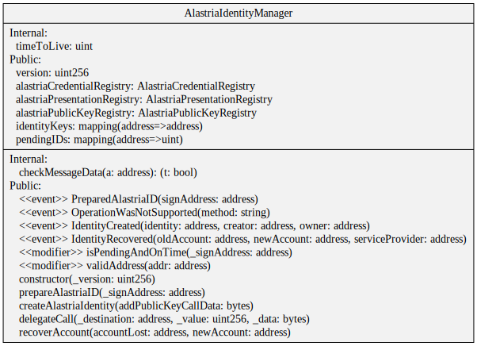
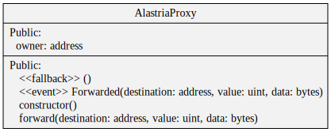
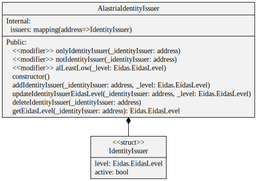
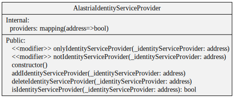
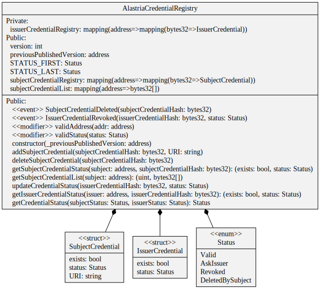
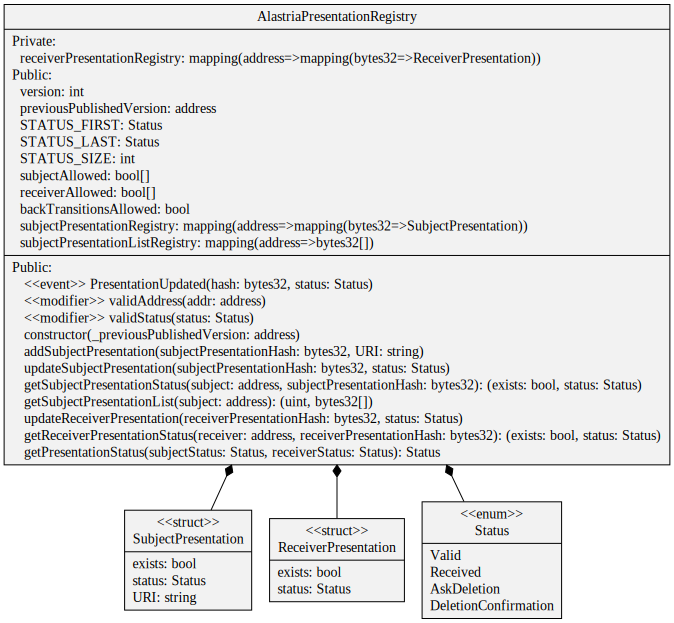
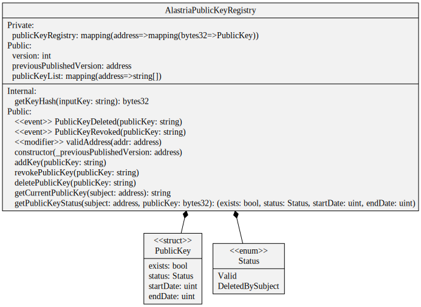
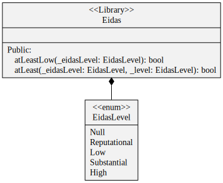
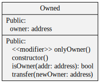

# Smart Contracts Documentation

```
Last update @ 6/11/2019
```

### 1. Identity Manager
|Contract      | What it does          | 
| :------------- |:-------------| 
| AlastriaIdentityManager.sol     |It generates access tokens, creates identities, deploys an AlastriaProxy for each identity and sends transactions through the proxy of the sender| 


|Contract      | What it does          | 
| :------------- |:-------------|
| AlastriaProxy.sol | It is the Alastria ID itself. Only receives transactions from the IdentityManager and resends them to the target  | 


|Contract      | What it does          | 
| :------------- |:-------------| 
| AlastriaIdentityIssuer.sol     | It keeps a registry of the issuers identities | 


|Contract      | What it does          | 
| :------------- |:-------------| 
| AlastriaIdentityServiceProvider.sol     |It keeps a registry of the service providers identities |



### 2. Registry
|Contract      | What it does          | 
|:------------- |:-------------| 
| AlastriaCredentialRegistry.sol     |It manages all the credentials and keeps the registry and the status | 


|Contract      | What it does          | 
|:------------- |:-------------| 
| AlastriaPresentationRegistry.sol     |It manages all the presentations and keeps the registry and the status |


|Contract      | What it does          | 
|:------------- |:-------------| 
| AlastriaPublicKeyRegistry.sol     | It manages all the public keys and keeps the registry |


### 3. Libs 
 The previous contracts use some libraries which are:
 
| Contract      | What it does          | 
|:------------- |:-------------| 
| Eidas.sol     | It manages Eidas level of assurance for credentials|


| Contract      | What it does          | 
|:------------- |:-------------| 
| Owned.sol     | It assures that just the account which deployed a contract can update the version | 



## Need Help?
Our identity core team will be happy to listen to you at [slack #identidaddigital](https://github.com/alastria/alastria-node/wiki/HELP)

