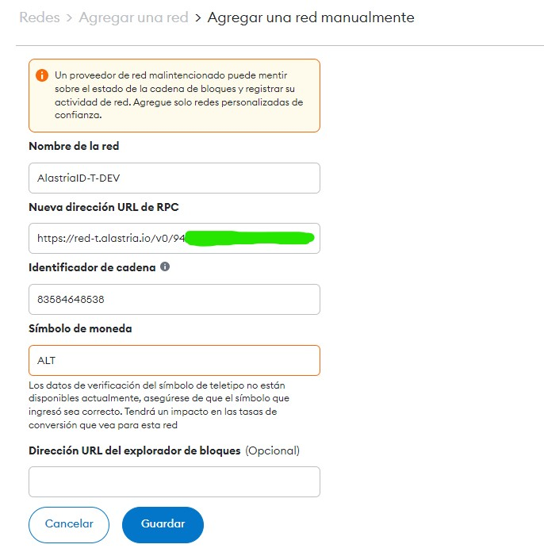
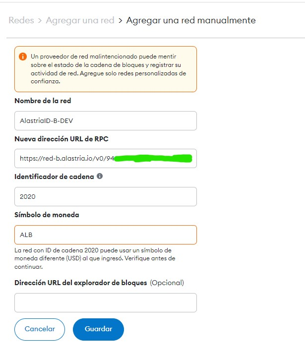
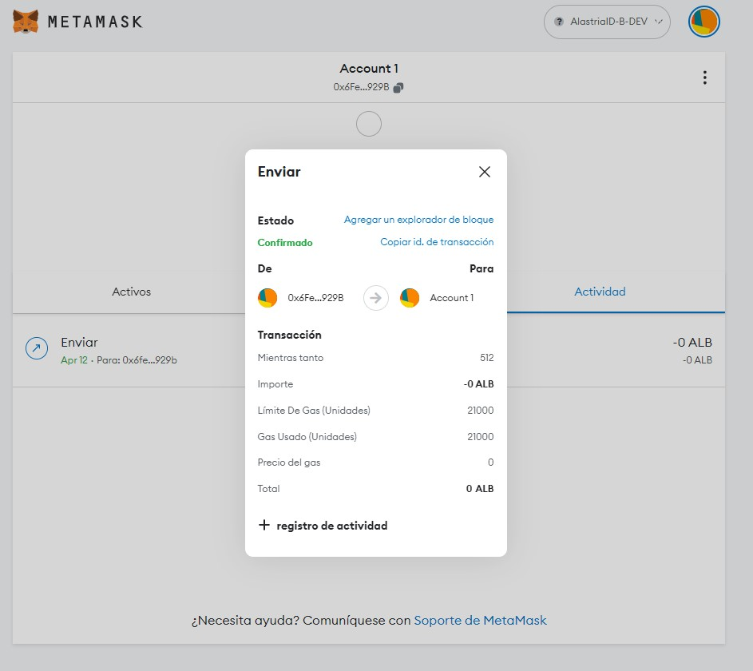
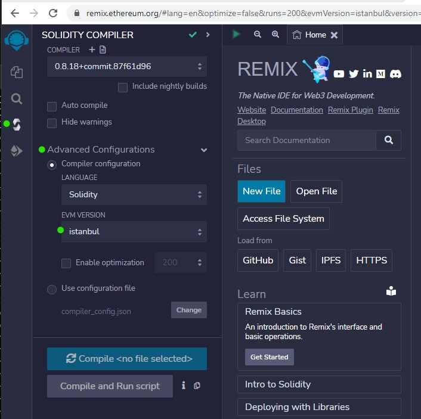
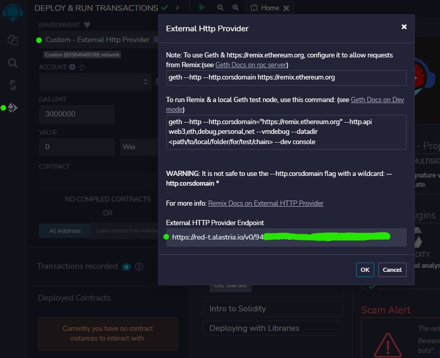
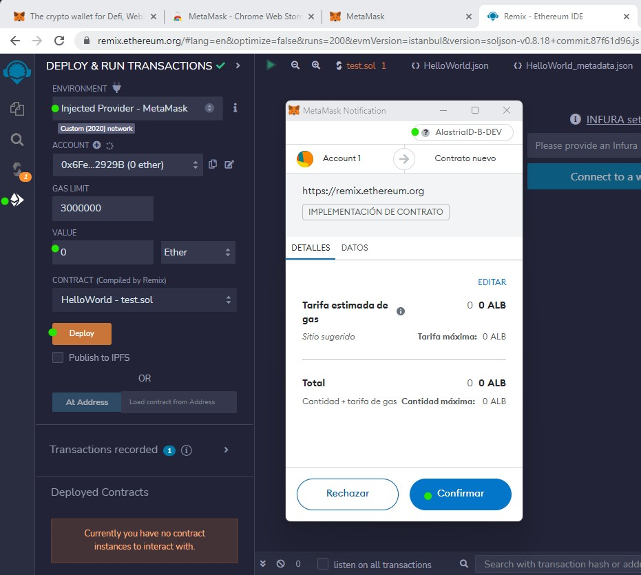

# AlastriaID Developer Node

Alastria provides a node in the T (GoQuorum, IBFT 1.0) and B (BESU, IBTF 2.0) networks for those developers who want to contribute to the AlastriaID project.

Access to this node is not open: access must be requested through this form.

This guide describes how to access this resource:

## Metamask

Metamask is a very popular wallet that can be used for managing Ethereum accounts in a simple way.

The connection with the nodes is made through the following URLs, using the access APIKEY:

* AlastriaT Network:


* AlastriaB Network:


### Example



## Remix

Remix is a well known development environment for Solidity that works both in the browser and on the desktop.

The connection to the nodes can be made directly to the RPC service (http) of the node, or through Metamask

There are some settings to consider for a successful connection:

* Set EVM version (only for T Network):


* Use HTTP as Web3 provider:


* Or use Metamask as provider:


## Truffle

The connection to the node through Truffle is similar to those described above.

These examples are based on the repository https://github.com/alastria/smart-contract-deployment:

```
$ export SIGNER_PRIVATE_KEY=ae...
$ export T_NODE_IP=https://red-t.alastria.io/v0/94...
$ export B_NODE_IP=https://red-b.alastria.io/v0/94...
```

```
$ npm install --save-dev truffle ganache-cli @truffle/hdwallet-provider dotenv
```

```
$ truffle migrate --network alastriat

Compiling your contracts...
===========================
> Everything is up to date, there is nothing to compile.

Starting migrations...
======================
> Network name:    'alastriat'
> Network id:      83584648538
> Block gas limit: 30000000 (0x1c9c380)

2_deploy.js
===========

   Replacing 'HelloWorld'
   ----------------------
   > transaction hash:    0xa54affce6f2bdfd8436a6d42f74c37fdfc4a37d6a312bb22e8cc7157dcf3e363
   > Blocks: 2            Seconds: 4
   > contract address:    0x99254125d66C4257286337aAFd0a10fa5F5C63c8
   > block number:        110778776
   > block timestamp:     1681337364
   > account:             0x6Fea4B6c41D2B30D4eCf6417c0158B87dc52929B
   > balance:             0
   > gas used:            212131 (0x33ca3)
   > gas price:           0 gwei
   > value sent:          0 ETH
   > total cost:          0 ETH

   Pausing for 2 confirmations...
   ------------------------------
   > confirmation number: 2 (block: 110778778)
   > Saving artifacts
   -------------------------------------
   > Total cost:                   0 ETH


Summary
=======
> Total deployments:   1
> Final cost:          0 ETH
```